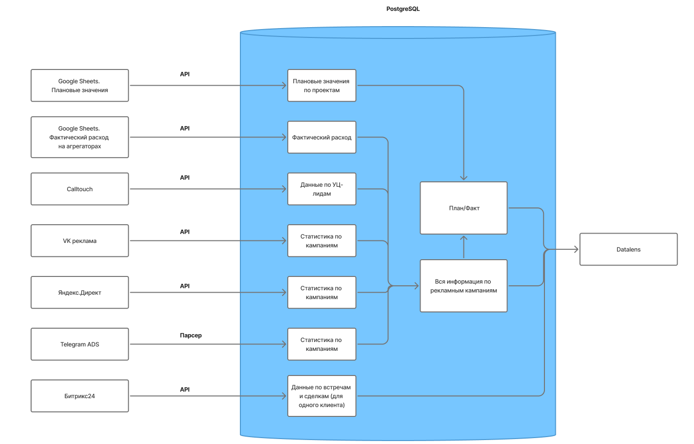

# Краткое описание

Создала с нуля дашборд в Yandex DataLens для отдела Digital и отдельные дашборды для клиентов, которые позволяют отслеживать эффективность рекламных кампаний в реальном времени и сокращают время подготовки отчётов на 80%.

# Контекст и цель
В маркетинговом агентстве вручную собирали отчёты из Calltouch, ЯндексДиректа, VK рекламы, Telegram Ads, CRM. 
Нужно было сократить время на сбор данных и иметь возможность в любой момент зайти в одно место и посмотреть результативность каждой рекламной кампании каждого проекта.
Решение этой проблемы дает обущую эффективность по управлению проектом, уменьшает вероятность человеческих ошибок, дает прозрачность процессов для клиентов.

В начальной точке был отчет в гугл-таблицах, который собирался вручную раз в неделю проджектами и ассистентов. В конечной: персонализированные отчеты для каждого клиента + общий сводный по всем проектам

# Инструменты и технологии
Стек:
SQL, Python, Yandex DataLens, Google Sheets, R, Git, PostgreSQL 

# Этапы работы / Подход к решению

1. Сначала собрала информацию:
- для каких целей нужен дашборд
- кто будет пользоваться дашбордом
- какие показатели хотим отслеживать
- из каких источников хотим брать информацию
- как часто он должен обновляться и тп

2. Составила архитектурное решение
[**Архитектура**](https://github.com/Olysechka02/Portfolio/blob/main/Материалы/Архитектурное%20решение%20для%20дашбордов.pdf)

3. Унифицировала систему UTM-меток для корректного ведения статистики

4. Составила план реализации со сроками + поставила тз подрядчику (сбор данных из каких источников, какие метрики. Какие витрины данных нужны) + коммуницировала с подрядчиком - полный цикл от постановки задач и согласовании их до оплаты реализованных задач

5. На основе витрин данных в БД создала дашборд по всем проектам (визуализация была на мне):
*картинки*

6. Обучила отдел смотреть инфомацию в Дашборде

# Результат

Автоматизация отчётности сократила ручной труд проджектов и ассистента digital отдела на ~7 часов в неделю.
Отдел Digital и Топ-менеджмент начал использовать дашборд как основной инструмент принятия решений.
Есть своя независимая БД 
У агентства появился новый продукт - Дашборд с показателми эффективности для клиента

Чему я научилась:
научилась планировать, коммуницировать с программистами, пользоваться SQL, строить БД с нуля, визуализировать данные в Datalens, работать с API, 

# Примеры и ссылки

*Скриншот дашборда*
*скриншот или вставка кода на SQL*
*скриншот или вставка кода на python*

# Что бы я улучшила при следующем подходе:
Добавила больше источников для автоматического сбора данных и отслеживанию доп метрик (Циан, Я.Недвижимость, Я.Метрика)
Внедрила более детализированные отчеты
Настроила бы доступ к одному дашборду разным клиентам, а не дублировала дашборды для каждого клиента

